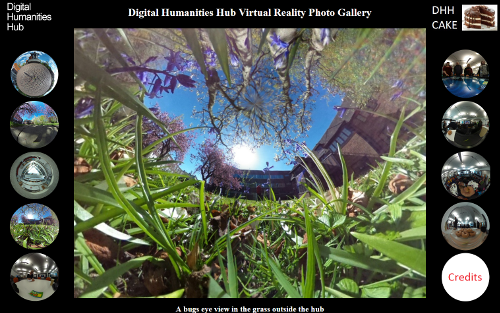

#Interacting with 360 degree photos on a webpage

##Introduction

The Digital Humanities Hub hold regular events for anyone interested in their work, which are known as CAKE events. The May 2016 CAKE was extra special because we invited collaborators and partners to bring their children along for lots of crazy fun. As the event was intended for young people we wanted to do some displays that were more geared to their interests, including a 3D game based on our offices, and colourful touch table apps. One of the things we decided to do for the kids was a VR photo web app, for spherical VR images such as you may take with a Ricoh Theta camera.

The web app gave the young people who came along a lot of fun zooming and panning around a variety of scenes from our VR photo collection. And, if you want to take a look, we've included those photos here. Since we created the web app quite a few people have taken an interest and asked for details of where to get a VR camera to take their own spherical images. So, the Digital Humanities Hub have decided to make the code open source, so anyone can quickly create their own online VR photo exhibition as soon as they get their new camera.

##Using the code on your own website

Setting the VR photo display web app up on your own website should be very simple: simply copy all the files and folders in the 'Website code' folder to a folder on your website. You should then be able to access it from any modern WebGL enabled browser (e.g. Firefox, Edge, Chrome). The 'thumbnails' folder contains all of the mini images displayed on the left and right of the page. When you replace our images with yours, just make square 150x150 pixel thumbnails of them and replace our ones. Similarly, just replace the larger images in the 'images' folder with your own, making sure you keep the same file names and ensure the number at the end of them corresponds between thumbnails and full images. We've used JPG files for the main images, and PNG files for the thumbnails (PNG files allow you to add transparency effects), so you'll need to change our code if you want to use different image types.

The page title, as well as an array of titles to go with each image, are found in the 'index.html' file. Simply open that in a plain text editor (we like Notepad++ on Windows, and gedit on Linux, but even Notepad should do the trick) and change all the titles to ones that go with your own images. Then you're ready to go and wow the world with your VR photography skills. And, if you have some techy knowledge, it should be easy to adapt the whole thing to add extra features or change the number of images you display.

## A bit of techy discussion for techy people

The web-code is just HTML, CSS and JavaScript. As most people do with anything 3D online, we used the excellent Three.js library to create a WebGL sphere onto which the spherical images are mapped. The main image view is therefore a 3D scene that makes it easy to view and manipulate the spherical picture. We used the Three.js controls to make rotating the view as simple and intuitive as possible, and added some extra code to allow viewers to zoom in and out with their mouse's scroll wheel (see 'photosphere.js' in the 'code' folder).

The way the code is set up means that it's relatively easy to adapt it to include 3D models in the scene: think 3D robots battling it out in the middle of Wembley Stadium! You could even use a Three.js video texture for VR video viewing. We've played with that concept at the Digital Humanities Hub, adding some 3D objects into the 'video dome', and can definitely say it's a fun and exciting concept for future work.

##About the Digital Humanities Hub

The Digital Humanities Hub focuses on collaborative triple helix working across the Arts and Humanities with cultural and heritage organisations, digital and creative industries and academics to develop collaborative and innovative digital prototypes. It is based on the University of Birmingham's Edgbaston Campus in the UK and you can visit the Hub's website at http://www.birmingham.ac.uk/facilities/digitalhumanitieshub/index.aspx

##Use and licensing

The code here is licensed open-source under the permissive MIT license (see the LICENSE file on this repository) to enable you to make full use of it in your own web and art installations.

##Credits

This piece of work was inspired and motivated by all the young people who attended the Digital Humanities Hub Kids CAKE event in May 2016.

Programming of the 3D scene on which the spherical images are mapped for display used the excellent Three.js JavaScript library at http://threejs.org/ and any of their files included in this repository are provided for convenience: you should replace them with the latest version of Three.js and use them only in accordance with their own license conditions.

Concept and development by Andrew Thomas and Lara Ratnaraja from the Digital Humanities Hub. Coding by Andrew Thomas.

